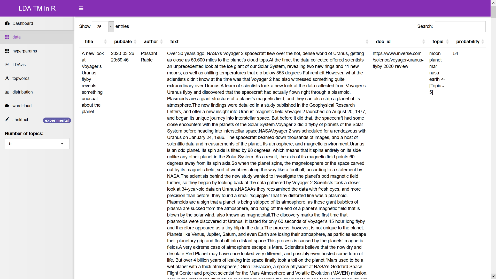
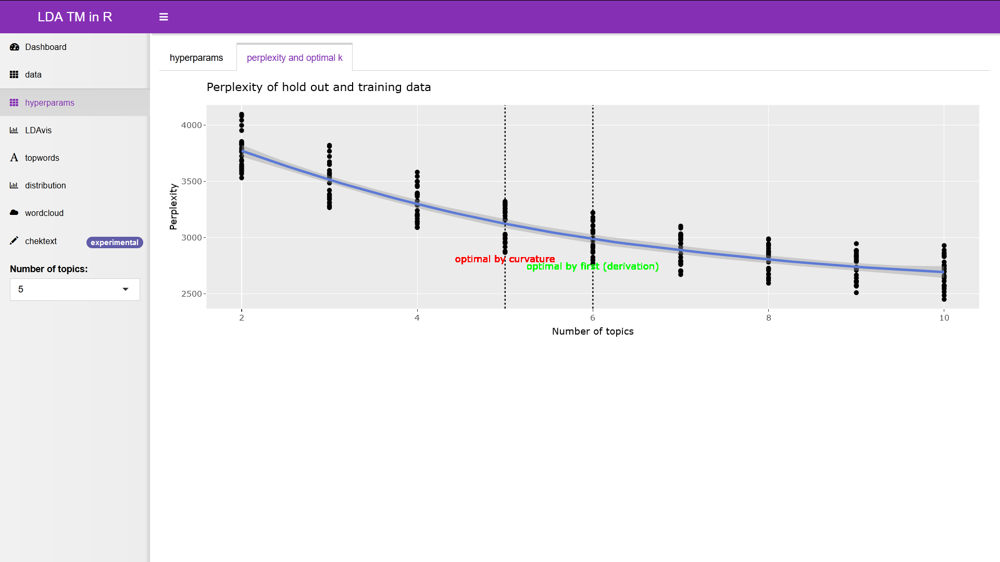
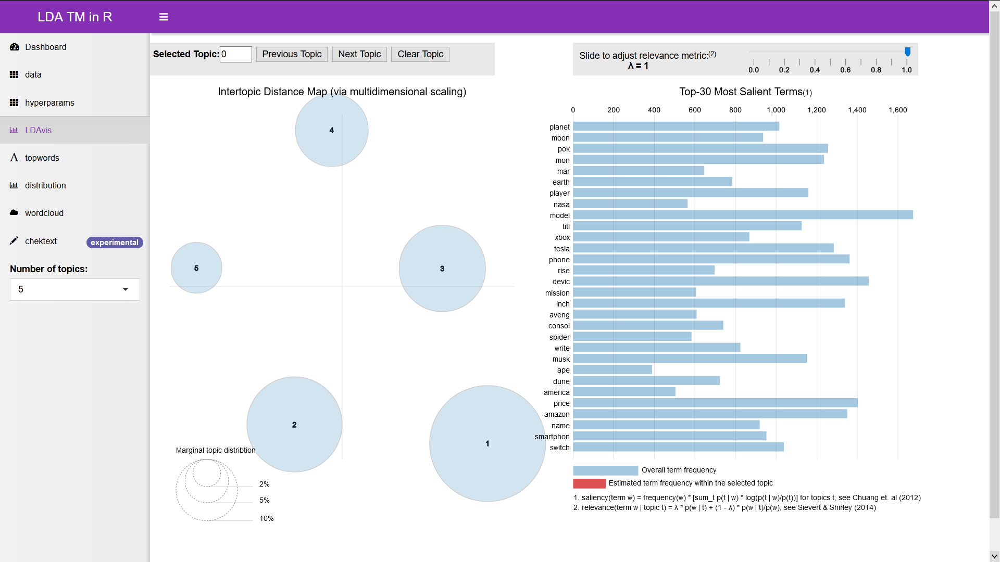
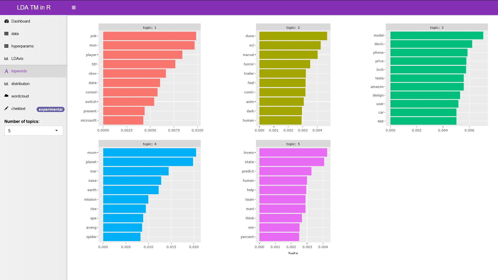
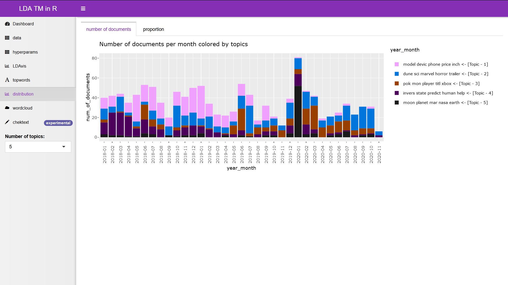
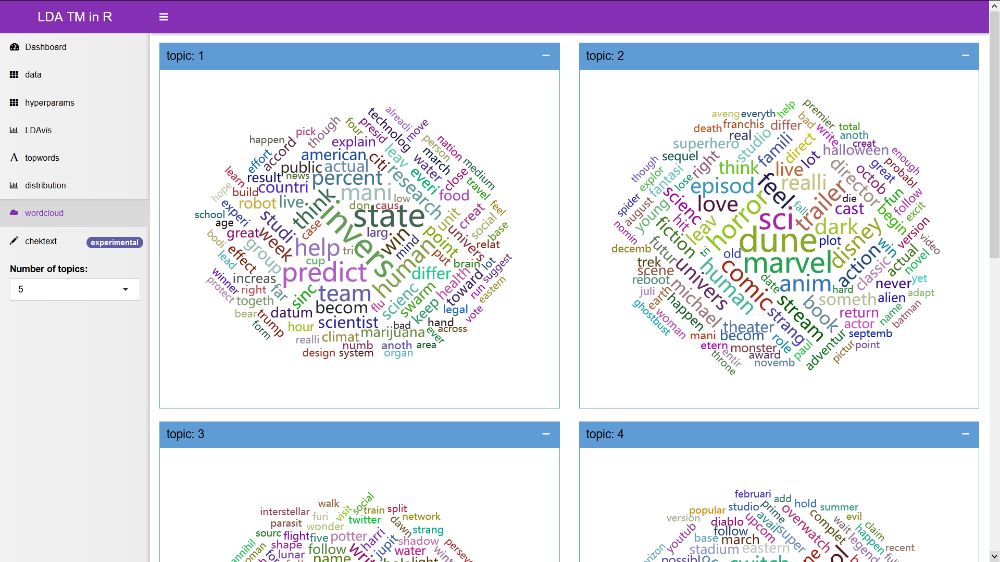
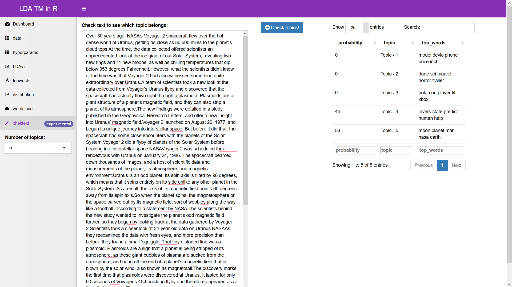

# Topic modeling using LDA and R

In natural language processing, the latent Dirichlet allocation (LDA) is a generative statistical model that allows sets of observations to be explained by unobserved groups that explain why some parts of the data are similar.

This project covers:
* **`scraper`** of [Invers](www.inverse.com). In short, [Invers](www.inverse.com) is an American digital company that covers the latest news and advancements in science, entertainment, gaming, innovation, and the mind and body. With web scraper, we obtain a list of links to articles published on site. For each article, we collect meta information such as blog title, publication date, author, content, and destination (URL). With slight modification, we can scrap other news as well.
* `modeling`. Here we build an LDA topic model. We train several models using `Gibbs` method with varying numbers of topics and hyperparameters using grid search and fold validation. Based on the results of the previous process we determine the optimal number of topics. To infer a reasonable topic number we based our conclusion on perplexity and use the elbow method to compute knee (our optimal number of topics) using first derivative and curvature.
* `shiny`. Here we build an interactive dashboard which contains:
  - data exploration (training data with assigned topic probabilities) <sup>[1](#foot1)</sup>
  - information of hyperparams as well as perplexity plot with information of an optimal number of topics
  - top 10 high word frequency graph for each topic <sup>[1](#foot1)</sup>
  - LDAvis <sup>[1](#foot1)</sup>
  - topic distributions over time as well as topic proportions over time <sup>[1](#foot1)</sup>
  - WordClouds which show us words that are strongly associated with each topic <sup>[1](#foot1)</sup>
  - check text [experimental], give the user to put input text and see which topic given text belongs <sup>[1](#foot1)</sup>

<a name="foot1">[1]</a>: User can choose a variable number of topics (limited to trained ones)

How each part of the project interacts with each other can be seen in the next picture:

## shiny dashboard screenshots
| | | |
|:-------------------------:|:-------------------------:|:-------------------------:|
| |  ||
|  |  ||
|  |  |

## Requirements

* [Docker](https://www.docker.com/) with docker compose.
* Internet connection


## Technologies
  * R
  * Shiny
  * Docker
  * Linux

## Usage

Each part of the project can be run as a separate service.

### scraper

To start container without user interaction execute
```bash
docker-compose --file docker-compose.yml up --detach --force-recreate scraper
```
The container will shut down after the entry point script finished their work.

To start container with user interaction (useful when we need to debug our app) execute
```bash
docker-compose --file docker-compose-debug.yml up --detach --force-recreate scraper
```
Open [localhost:3838](localhost:3838).

Container name by default will be `scraper-app`.

### modeling

To start container without user interaction execute
```bash
docker-compose --file docker-compose.yml up --detach --force-recreate modeling
```
The container will shut down after the entry point script finished their work.

To start container with user interaction (useful when we need to debug our app) execute
```bash
docker-compose --file docker-compose-debug.yml up --detach --force-recreate modeling
```
Open [localhost:3838](localhost:3838).

Container name by default will be `modeling-app`.

### shiny
To start shiny container execute
```bash
docker-compose --file docker-compose.yml up --detach --force-recreate shiny
```
Open [localhost:8080](localhost:8080).

Container name by default will be `shiny-app`.

## Future work
* Add a comparison of an optimal number of topics between our implementation and `FindTopicsNumber` from `R` `ldatuning` library. `FindTopicsNumber` can use various metrics for determining optimal topic numbers such as `Griffiths2004`, `CaoJuan2009`, `Arun2010`, and `Deveaud2014`.
* Implement a `coherence` score aside `perplexity` for determining the optimal number of topics.
* Implement a hierarchical Dirichlet process (HDP). The HDP mixture model is a natural nonparametric generalization of LDA, where the number of topics can be unbounded and learnt from data.

## TODO
* create a more structured project
* convert some part of the project into a meaningful R library
* create a docker image for each service which can be easily pulled instead of building an image with package installation (took some time if image is not created before)
* use shiny with nginx

## Useful commands:
```
# print docker-compose configuration, useful for checking if each parameter is set correctly
docker-compose -f <docker-compose-yaml-file-path> config
# rebuld docker image if we made changes, recreate <service> if it is already started and detach it
docker-compose --file <docker-compose-yaml-file-path> up --detach --force-recreate --build <service>
# stop all docker-compose services defined in docker-compose.yaml file
docker-compose down
# check logs from <container_name>, useful for debuging
docker logs <container_name>
```

## Test environment

```
> Microsoft Windows [Version 10.0.19041.572]
(c) 2020 Microsoft Corporation. Sva prava pridržana.

> Distributor ID: Ubuntu
Description:    Ubuntu 20.04.1 LTS
Release:        20.04
Codename:       focal

> Docker version 19.03.13, build 4484c46d9d
```

## Contact
[vrukavina7@gmail.com](vrukavina7@gmail.com)
